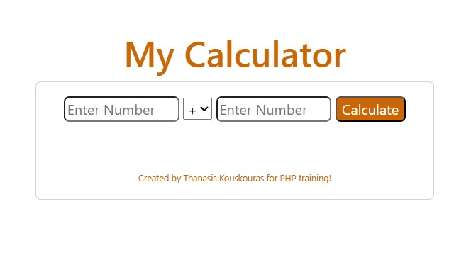
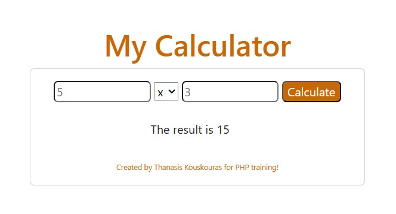
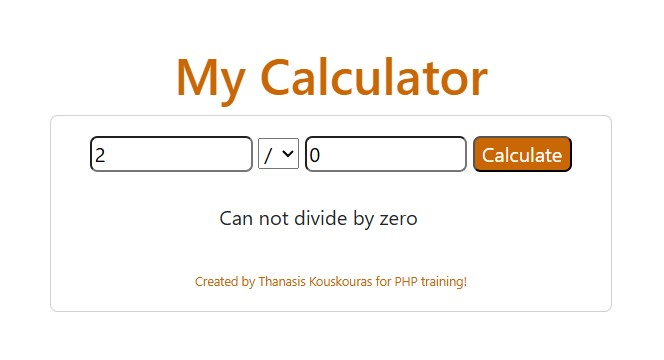

# PHP Calculator 🧮

## A simple web-based calculator built with PHP and Bootstrap for performing basic arithmetic operations.

## 📖 Description

This project is a basic calculator web application created as a PHP training exercise. It demonstrates fundamental PHP concepts including form handling, GET requests, conditional statements, and basic arithmetic operations with error handling.

The calculator features a clean, responsive design using Bootstrap and handles the four basic mathematical operations: addition, subtraction, multiplication, and division.

## ✨ Features

- **Basic Arithmetic Operations**: Addition (+), Subtraction (-), Multiplication (×), Division (÷)
- **Error Handling**: Division by zero protection and input validation
- **Responsive Design**: Bootstrap-powered interface that works on all devices
- **Form Persistence**: Input values are retained after calculation

## 🛠️ Technologies Used

- **PHP** - Server-side logic and calculations
- **HTML5** - Structure and markup
- **CSS3** - Custom styling
- **Bootstrap 5.3.2** - Responsive framework
- **JavaScript** - Bootstrap components (via CDN)

## 🖼️ Demo

### Calculator Interface


### Calculation Example


### Calculation Example



## ⚙️ Getting Started

### Prerequisites

- Web server with PHP support (XAMPP, WAMP, LAMP, or similar)
- PHP 7.0 or higher
- Web browser

### Installation

1. **Clone the repository**
   ```bash
   git clone https://github.com/thanasis-kouskouras/php-calculator.git

2. **Move the project to your server directory**
   
   - **For XAMPP (Windows):** 
     Move the folder into:
     ```
     C:\xampp\htdocs\
     ```
   
   - **For Linux/Mac (with XAMPP/LAMP):**
     ```bash
     cp -r php-calculator /opt/lampp/htdocs/
     ```
3. **Start your web server**
   
   Start **Apache server** if you have **XAMPP** 

5. **Access the application**
   
   Open your browser and navigate to: http://localhost/php-calculator/calculator.php


## 🤝 Contributing

This is a learning project, but contributions are welcome! Feel free to:

1. **Fork the repository**
   ```bash
   git fork https://github.com/thanasis-kouskouras/php-calculator.git
2. **Create a feature branch**
   ```bash
   git checkout -b feature/improvement
3. **Make your changes and commit them**
   ```bash
   git commit -m 'Add the improvement'
4. **Push to the branch**
   ```bash
   git push origin feature/improvement
5. **Open a Pull Request**
   - Go to the original repository on GitHub
   - Click **"New Pull Request"**
   - Select your feature branch from the dropdown
   - Write a clear title and detailed description of your changes
   - Click **"Create Pull Request"**

## 📄 License

This project is licensed under the [MIT License](LICENSE) - see the LICENSE file for details.
